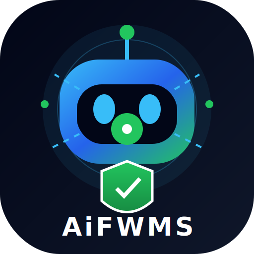
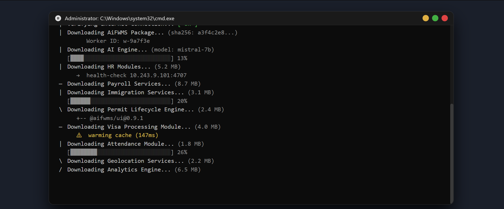
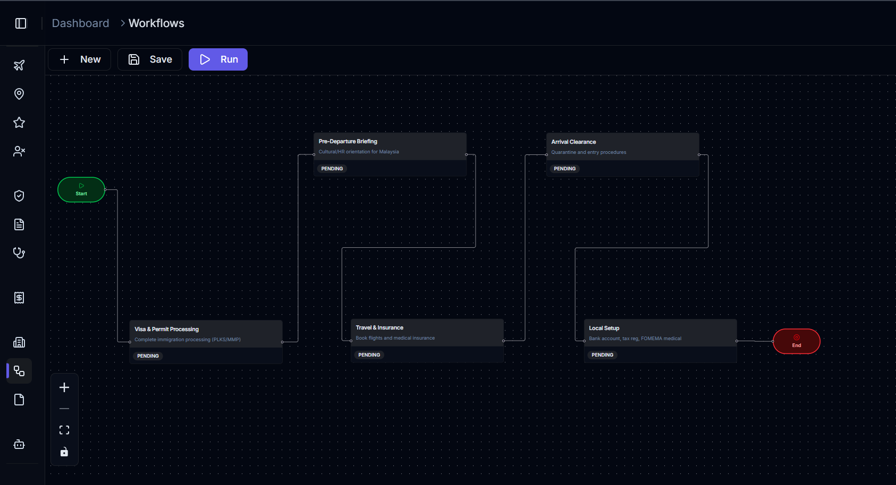
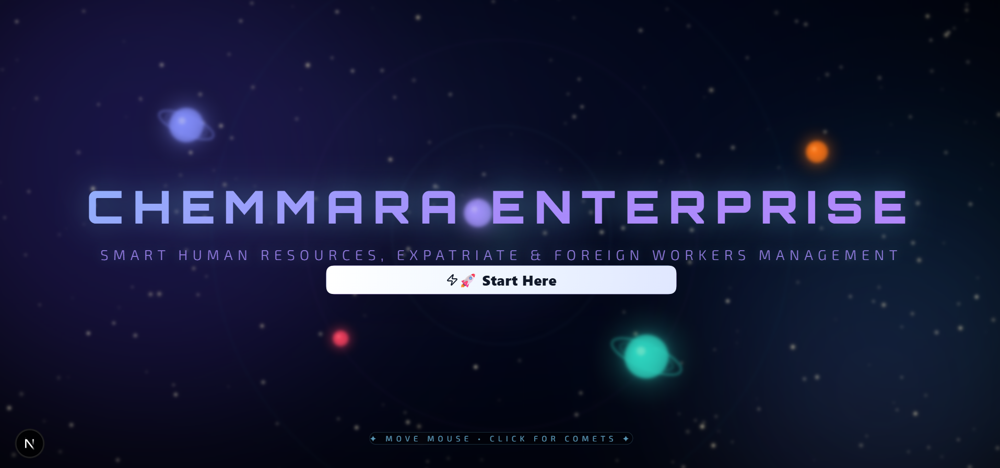
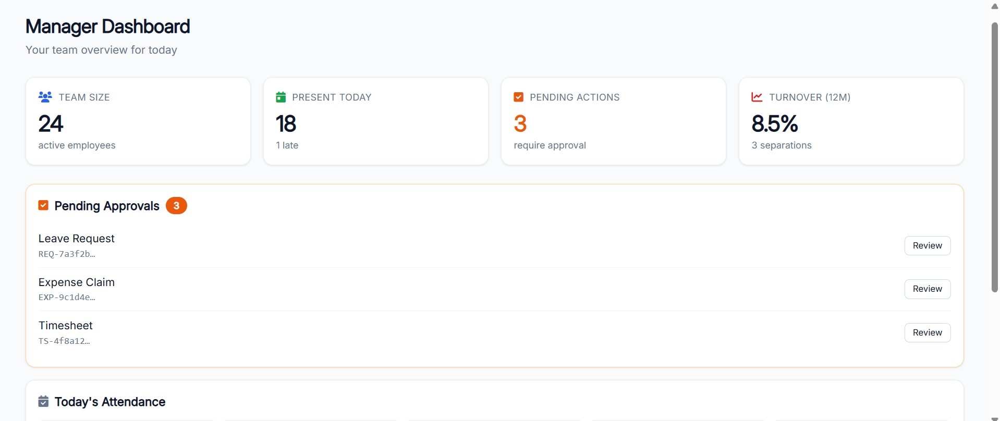
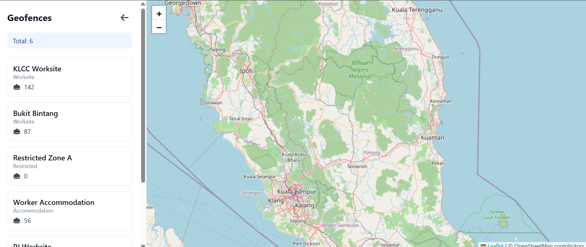
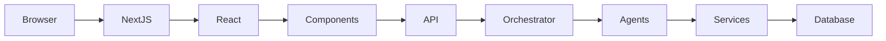
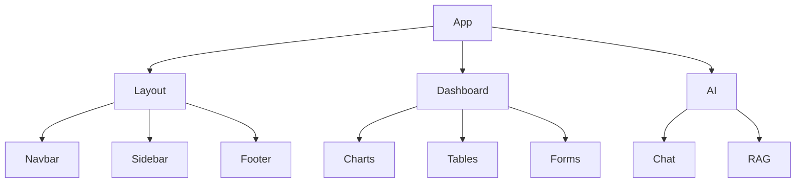
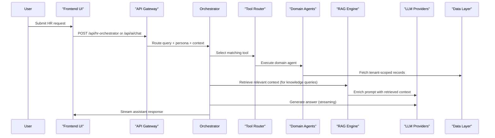
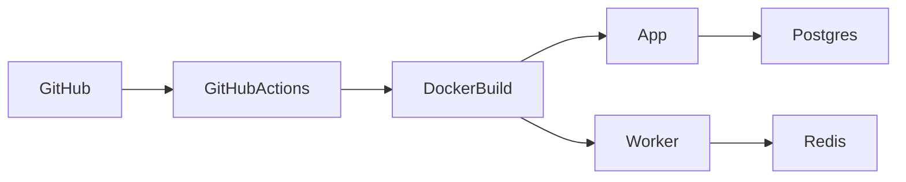

<!--
  AiFWMS — AI Foreign Worker Management System
  Enterprise-grade README generated from repository analysis.
  Note: No features were invented; uncertain items are marked with > **TODO:** Verify implementation.
-->

<div align="center">

  <!-- Logo placeholder -->
  

  # AiFWMS — Foreign Worker Management System

  <p>
    Enterprise Malaysian HR platform for <b>foreign worker compliance</b>, <b>permit & visa lifecycle</b>, <b>payroll support</b>, <b>geolocation attendance</b>, and an <b>AI-powered HR orchestration</b> layer.
  </p>

  <p>
    <a href="#quick-links">Quick Links</a> ·
    <a href="#getting-started">Getting Started</a> ·
    <a href="#architecture">Architecture</a> ·
    <a href="#security">Security</a>
  </p>

  <!-- Badges placeholder: shields are included below as well -->

</div>

---

## Badges

### Framework & Quality


### GitHub (repo signals)


### Package Managers


### Deployment / Status


---

## GitHub Buttons

<div align="center">

  <a href="https://github.com/kk666679/dashboardhr" target="_blank" rel="noreferrer">
    
  </a>

  <a href="https://github.com/kk666679/dashboardhr/issues" target="_blank" rel="noreferrer">
    
  </a>

  <a href="https://github.com/kk666679/dashboardhr/pulls" target="_blank" rel="noreferrer">
    
  </a>

  <a href="https://github.com/kk666679/dashboardhr/discussions" target="_blank" rel="noreferrer">
    
  </a>

  <a href="https://github.com/kk666679/dashboardhr/releases" target="_blank" rel="noreferrer">
    
  </a>

</div>

---

## Quick Links

- Live Demo: > **TODO:** Verify implementation.
- Documentation: `docs/` and in-repo guides (see **Docs Roadmap**)
- Issues: https://github.com/kk666679/dahboardhr/issues
- Discussions: https://github.com/kk666679/dashboardhr/discussions
- Releases: https://github.com/kk666679/dashboardhr/releases
- License: `PROPRIETARY` (see `LICENSE`)

---

## Table of Contents

<!-- Auto-generated style ToC (manual but consistent with GitHub) -->

- [Hero / Overview](#aifwms--ai-foreign-worker-management-system)
- [Badges](#badges)
- [GitHub Buttons](#github-buttons)
- [Quick Links](#quick-links)
- [Screenshots](#screenshots)
- [Features](#features)
- [Tech Stack](#tech-stack)
- [Architecture](#architecture)
- [Folder Structure](#folder-structure)
- [Getting Started](#getting-started)
- [Environment Variables](#environment-variables)
- [Scripts](#scripts)
- [Development Workflow](#development-workflow)
- [Code Style](#code-style)
- [Performance](#performance)
- [Security](#security)
- [Accessibility & SEO](#accessibility--seo)
- [Testing](#testing)
- [Deployment](#deployment)
- [Monitoring](#monitoring)
- [CI/CD](#cicd)
- [Roadmap](#roadmap)
- [Contributing](#contributing)
- [Changelog](#changelog)
- [FAQ](#faq)
- [Troubleshooting](#troubleshooting)
- [License](#license)

---

## Screenshots

> Placeholders (replace these paths with real images once available).

### Desktop CMD



### Flow Design



### Landing Page



### Manager Self Service [MSS] Dashboard



### Live Location



---

## Features

> Organized by area. If a feature cannot be verified from the repository/docs, it is marked with `> **TODO:** Verify implementation.`

<details>
<summary><h3>Core (Enterprise Foundation) 🧱</h3></summary>

- Multi-tenant architecture driven by `tenantId`
- API-first design (Next.js App Router + tRPC layer + domain services)
- AI orchestration for HR-related queries and workflow support
- Prisma-based PostgreSQL persistence (including pgvector support)
- Tenant-aware data scoping (avoid cross-tenant leakage)

</details>

<details>
<summary><h3>Foreign Worker Compliance & Compliance Center 🇲🇾</h3></summary>

- Foreign worker permit & visa lifecycle management
- Compliance tracking and audit support aligned to Malaysian requirements
- FOMEMA medical screening and expiration alerts
- Renewal tracking and escalation concepts documented in roadmap

> **TODO:** Verify implementation for “audit semantics” beyond the existing code paths.

</details>

<details>
<summary><h3>Payroll, Documents & Accounting Support 💼</h3></summary>

- Payroll related workflows and calculations (see existing pages/components)
- Document generation and PDF rendering (uses `@react-pdf/renderer`)
- E-invoice/invoice workflows are referenced in the existing README

> **TODO:** Verify implementation for e-invoice details and export formats.

</details>

<details>
<summary><h3>AI / ML Orchestration 🤖</h3></summary>

- Multi-agent HR orchestrator (domain-specific tools)
- Provider-agnostic AI with OpenAI, Anthropic Claude, and Ollama
- RAG pipeline (knowledge retrieval + context assembly)
- Streaming chat endpoints for live assistant experience

</details>

<details>
<summary><h3>Automation & Workflow Execution ⏱️</h3></summary>

- React Flow-based workflow designer references in docs/roadmap
- Workflow monitoring and queueing via BullMQ are implied by dependencies

> **TODO:** Verify implementation of the “workflow execution engine” in the current code.

</details>

<details>
<summary><h3>Geolocation Attendance & Compliance 📍</h3></summary>

- Attendance tracking and geolocation-based compliance (pages/components exist)

> **TODO:** Verify implementation of exact geofence rules and exception handling.

</details>

---

## Tech Stack

| Layer | Technology | Purpose |
|---|---|---|
| Frontend | Next.js (App Router), React | UI + routing |
| Language | TypeScript | Type-safe enterprise codebase |
| Styling | Tailwind CSS + shadcn/ui + Radix UI | Design system and responsive UI |
| Backend/API | Next.js Route Handlers + tRPC | API layer and type-safe contracts |
| Runtime | Node.js | Server/runtime execution |
| Database | PostgreSQL + Prisma | Persistence and relational model |
| Vector/AI Search | pgvector + embeddings libs | Semantic retrieval for RAG |
| Auth & Sessions | > **TODO:** Verify implementation (repo likely includes auth under `server/`)
| AI Orchestration | Vercel AI SDK + @ai-sdk/* + LangChain Ollama | Streaming LLM + provider abstraction |
| Async Jobs | BullMQ + Redis | Background processing/workflows |
| Charts/UX | Recharts, React Flow, Framer Motion | Enterprise dashboards and visual workflows |
| Testing | Jest / unit tooling (jest globals present) | Quality gates |
| Code Quality | ESLint, Prettier | Enforced formatting/linting |
| Containerization | Docker / Docker Compose | Reproducible deployments |

---

## Architecture

<details>
<summary><h3>Overall Architecture</h3></summary>



</details>

<details>
<summary><h3>Application Flow (Middleware → Auth → App Router)</h3></summary>

```mermaid
flowchart TD
  User
  ↓
  Middleware
  ↓
  Authentication
  ↓
  App Router
  ↓
  Layout
  ↓
  Pages / Routes
  ↓
  Components
  ↓
  API / tRPC
  ↓
  Services
  ↓
  Database
```

</details>

<details>
<summary><h3>Component Relationship</h3></summary>



</details>

<details>
<summary><h3>AI Orchestration Flow (Multi-Agent + Tools + RAG)</h3></summary>



> Endpoint paths exist per current README: `/api/hr-orchestrator`, `/api/ai/chat`, `/api/ai/rag`, `/api/ai/reason`.

</details>

---

## Folder Structure

Below is a modern tree aligned to what exists in this repository.

```text
app
├── api
│   ├── ai
│   ├── hr-orchestrator (or similar)
│   └── ...
├── (product areas)
│   ├── agents
│   ├── ai-chat
│   ├── attendance
│   ├── compliance
│   ├── employees
│   ├── learning
│   ├── leave
│   ├── payroll
│   ├── reports
│   ├── talent
│   └── ...
└── globals.css

components
├── ui
├── dashboard
├── ai-elements
├── ai
├── charts
└── ...

contexts
├── RBACContext
├── TenantContext
└── ThemeContext

hooks
├── client
└── (domain hooks)

lib
├── actions
├── ai
├── integrations
├── kb
├── orchestrator
├── security
├── services
├── rag
├── prisma
└── ...

prisma
├── migrations
└── schema.prisma (via prisma config)

server
├── agents
└── routers (if present) / middleware

workers
└── (queue/worker entrypoints)

backend
└── (aux/test scripts for multi-agent curl / system tests)
```

### Key directories

- `app/`: Next.js App Router routes, pages, and route handlers.
- `components/`: UI primitives, dashboard pages, AI widgets, and specialized modules.
- `contexts/`: Tenant + RBAC + theme state.
- `hooks/`: typed client hooks for tRPC/data fetching and AI helpers.
- `lib/`: domain services, RAG orchestration, embeddings, and shared utilities.
- `prisma/`: schema + migrations.
- `server/`: server-side agents and orchestration utilities.
- `workers/` and `backend/`: queue/worker entrypoints and test scripts.

---

## Getting Started

<details>
<summary><h3>Prerequisites</h3></summary>

- Node.js (project uses Node 22 in Docker)
- npm (or pnpm/yarn)
- Git
- PostgreSQL + Redis (local via Docker Compose)

</details>

<details>
<summary><h3>Installation</h3></summary>

```bash
git clone https://github.com/mafieq737/fwms.git
cd fwms
npm install

# Prisma setup
npx prisma generate
npx prisma db push
```

</details>

<details>
<summary><h3>Environment Configuration</h3></summary>

Copy `./.env.example` to `.env.local`:

```bash
cp .env.example .env.local
```

Then update values as needed.

</details>

<details>
<summary><h3>Run the app</h3></summary>

```bash
npm run dev
```

</details>

<details>
<summary><h3>Run with Docker Compose</h3></summary>

```bash
docker-compose up
```

This starts:
- `postgres` (pgvector image)
- `redis`
- `app` (Next.js)
- `worker` (background tasks)

</details>

---

## Environment Variables

> Based on `.env.example`, `docker-compose.yml`, and `prisma.config.ts`.

| Variable | Description | Required | Default |
|---|---|---:|---|
| `DATABASE_URL` | PostgreSQL connection string | ✅ | > **TODO:** Verify from env example |
| `OPENAI_API_KEY` | OpenAI key (optional depending on AI provider selection) | ⛳ | `your-openai-key` |
| `EMBEDDINGS_MODEL` | Embeddings model name | ⛳ | `text-embedding-ada-002` |
| `NODE_ENV` | Node environment | ⛳ | `development` |
| `NEXT_PUBLIC_APP_URL` | Public app base URL | ⛳ | `http://localhost:3000` |
| `REDIS_URL` | Redis connection string (Docker) | ⛳ | `redis://redis:6379` |
| `SECRETS_PROVIDER` | Secrets provider selection (Docker) | ⛳ | `env` |
| `NEXT_PUBLIC_TENANT_ID` | Tenant identifier for UI scoping | ⛳ | `tenant1` |

Legend: ✅ required for local dev; ⛳ optional/conditional.

> **TODO:** Verify implementation for additional required AI/env vars (e.g., Anthropic/Ollama keys) beyond what is in `.env.example`.

---

## Scripts

Based on `package.json`.

| Script | Command | Purpose |
|---|---|---|
| Dev | `npm run dev` | Start Next.js dev server |
| Build | `npm run build` | Build production artifacts |
| Start | `npm run start` | Run production server |

> **TODO:** Verify ESLint/Prettier/test scripts (they may exist in config files or packages but aren’t present in current `package.json`).

---

## Development Workflow

- Create a feature branch
- Implement changes with TypeScript + existing domain conventions
- Ensure tenant scoping and RBAC/ABAC checks stay intact
- Open a Pull Request
- CI checks must pass (build/type checks) 

Docs used by contributors:
- `docs/QUICK_START.md`
- `docs/REQUIREMENTS.md`
- `docs/DESIGN.md` / `docs/*` (see `docs/`)

---

## Code Style

<details>
<summary><h3>TypeScript & Project Conventions</h3></summary>

- Prefer domain services in `lib/`.
- Prefer typed Zod schemas for validation (see `lib/schemas*`).
- Use tRPC for client↔server calls (repo guidance emphasizes “no fetch(); use tRPC”).
- Keep server-only logic out of client components (`'use client'`).

</details>

<details>
<summary><h3>ESLint & Prettier</h3></summary>

- ESLint and Prettier are expected to be configured for consistent formatting.
- Current `README` should reflect project quality gates.

> **TODO:** Verify exact lint/typecheck/test commands (scripts not visible in current `package.json`).

</details>

---

## Performance

<details>
<summary><h3>Key Considerations</h3></summary>

- Use streaming responses for AI endpoints to improve perceived latency
- Keep dashboard queries tenant-scoped to reduce result size
- Use caching/memoization for expensive calculations where safe
- Avoid N+1 patterns in Prisma queries

> **TODO:** Verify whether the repo uses specific Next.js optimization patterns (SSR/SSG/ISR/caching) in production route handlers.

</details>

---

## Security

<details>
<summary><h3>Access Control</h3></summary>

- Multi-tenant scoping with `tenantId`
- RBAC context exists in `contexts/RBACContext.tsx`

> **TODO:** Verify ABAC enforcement strategy and DB-level RLS usage.

</details>

<details>
<summary><h3>Secrets & Environment Safety</h3></summary>

- Production deployments should store secrets in a secrets manager.
- Docker Compose uses `SECRETS_PROVIDER=env` (local-only). 

> **TODO:** Verify integration with an actual secrets manager implementation.

</details>

<details>
<summary><h3>Compliance & Auditability</h3></summary>

- Repository documentation includes audit trail and compliance concepts.
- Ensure sensitive values are masked in responses where required.

> **TODO:** Verify sensitive field masking implementation.

</details>

---

## Accessibility & SEO

<details>
<summary><h3>Accessibility</h3></summary>

- Use semantic HTML for forms and tables
- Ensure keyboard navigation for UI flows
- Verify contrast and focus states (Tailwind + shadcn UI)

> **TODO:** Verify WCAG evaluation and test tooling.

</details>

<details>
<summary><h3>SEO & Metadata</h3></summary>

- Use Next.js metadata APIs per route needs
- Provide Open Graph/Twitter metadata for public pages

> **TODO:** Verify metadata implementation in `app/` routes.

</details>

---

## Testing

<details>
<summary><h3>What to Run</h3></summary>

> **TODO:** Verify available test commands. `package.json` currently lists only build/dev/start scripts.

</details>

<details>
<summary><h3>Guidance</h3></summary>

- Add unit tests for domain logic and services
- Add integration tests for tRPC procedures
- Add E2E tests for critical flows (login, tenant isolation, payroll run, renewal alerts)

</details>

---

## Deployment

<details>
<summary><h3>Vercel</h3></summary>

- Recommended for Next.js deployment.
- AI runtime for route handlers should be compatible with Node.js runtime.

> **TODO:** Verify exact Vercel configuration (if any) exists in repo.

</details>

<details>
<summary><h3>Docker</h3></summary>



</details>

<details>
<summary><h3>Production Docker Notes</h3></summary>

- Use the multi-stage `Dockerfile`:
  - `development` target for local runs
  - `production` target for runtime

> **TODO:** Verify actual `server.js` generation approach in Next build output.

</details>

---

## Monitoring

<details>
<summary><h3>Operational Observability</h3></summary>

- Monitor queue performance (BullMQ) and worker health
- Log AI provider failures and fallback usage
- Track audit events and error rates

> **TODO:** Verify logging/telemetry integration (e.g., pino usage) in code.

</details>

---

## CI/CD

<details>
<summary><h3>GitHub Actions (Roadmap)</h3></summary>

Roadmap explicitly calls for a build gate and typecheck workflow in Sprint 1:
- `npm run build` + `tsc --noEmit`

> **TODO:** Verify actual GitHub Actions workflows in `.github/`.

</details>

---

## Roadmap

The project follows a milestone-based sprint model. See:
- `docs/MILESTONES.md`
- `docs/CHANGELOG.md`

<details>
<summary><h3>High-level Milestones</h3></summary>

- **Sprint 1 — Build Recovery & Technical Stabilization**: restore clean TypeScript + production build gate
- **Sprint 2 — FWMS Core Completion**: expatriate/foreign worker lifecycle workflows + analytics
- **Sprint 3 — Compliance & Automation Enhancements**: permit/pass renewal reminders, FOMEMA tracking, HR sync, workflow execution
- **Sprint 4 — ISO/QMS Integration**: link evidence to ISO 9001 / ISO 27001 frameworks

</details>

---

## Contributing

<details>
<summary><h3>How to Contribute</h3></summary>

1. Fork the repo
2. Create a feature branch
3. Follow existing patterns in `docs/QUICK_START.md`
4. Submit a PR
5. Ensure CI/build passes and TypeScript remains clean

</details>

<details>
<summary><h3>Contribution Principles</h3></summary>

- Preserve tenant isolation and RBAC safety
- Never bypass tRPC contracts
- Keep server-only logic in server paths
- Maintain audit/compliance alignment

</details>

---

## Changelog

See `docs/CHANGELOG.md` for sprint progress and versioning.

---

## FAQ

<details>
<summary><h3>Which AI providers are supported?</h3></summary>

From the repository’s stated stack: OpenAI, Anthropic Claude, and Ollama.

> **TODO:** Verify exact environment variable matrix for each provider.

</details>

<details>
<summary><h3>Is the system multi-tenant?</h3></summary>

Yes. The architecture includes tenant scoping via `tenantId` and `TenantContext`.

</details>

<details>
<summary><h3>How do I run local development?</h3></summary>

Run `npm install`, then `npx prisma generate` + `npx prisma db push`, then `npm run dev`.

</details>

---

## Troubleshooting

<details>
<summary><h3>Prisma connection errors</h3></summary>

- Ensure PostgreSQL is running and `DATABASE_URL` is correct.
- If using Docker Compose, confirm `postgres` health check passed.

</details>

<details>
<summary><h3>AI provider errors</h3></summary>

If provider keys aren’t available, the repo’s README mentions local orchestrator fallback.

> **TODO:** Verify behavior for missing OpenAI/Anthropic/Ollama keys.

</details>

<details>
<summary><h3>Build fails due to TypeScript issues</h3></summary>

- Follow `docs/MILESTONES.md` Sprint 1 stabilization guidance.
- Run `tsc --noEmit` and fix strict typing issues.

</details>

---

## License

PROPRIETARY — see `LICENSE`.

---

## Acknowledgements

- Next.js, React, TypeScript
- Tailwind CSS + shadcn/ui
- Prisma
- Vercel AI SDK
- Open source community contributors

---

## Footer

Made with ❤️ using

- Next.js
- React
- TypeScript
- Tailwind CSS

