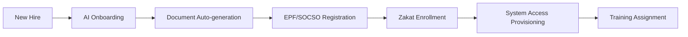

# 🚀 AI-HRMS - Intelligent HR Management System

> A modern, AI-powered, multi-tenant HRMS platform designed for Malaysian companies. Features include automated HR operations, Islamic finance compliance, and real-time analytics powered by AI agents.


---

## 📋 Table of Contents

- [Overview](#overview)
- [HR Roles & AI-Enhanced Capabilities](#hr-roles--ai-enhanced-capabilities)
- [System Capabilities Matrix](#system-capabilities-matrix)
- [Workflow Automation](#workflow-automation-examples)
- [Enterprise Integration](#enterprise-integration-capabilities)
- [Quick Start](#quick-start)
- [Tech Stack](#tech-stack)
- [Contributing](#contributing)
- [License & Certifications](#license--certifications)

---

## 🌟 Overview

AI-HRMS is a comprehensive human resource management system built specifically for Malaysian companies, featuring:

- ✅ **Full Malaysian Compliance** - Employment Act 1955, PDPA, Industrial Relations Act 1967
- 🕌 **Islamic Finance Integration** - Zakat, Tabung Haji, Sharia-compliant payroll
- 🤖 **AI-Powered Insights** - Predictive analytics, sentiment analysis, bias detection
- 🌍 **Foreign Worker Management** - Immigration, FOMEMA, work permit tracking
- 📊 **Real-time Analytics** - Workforce planning, attrition prediction, compliance monitoring
- 🔄 **Multi-tenant Architecture** - Scalable for enterprise deployment
- 🌐 **Multi-language Support** - BM, English, Chinese, Tamil, Bengali, Nepali, Indonesian
- 🎯 **Multi-Agent AI System** - Intelligent orchestration of specialized AI agents for HR tasks

---

## 🧠 HR Roles & AI-Enhanced Capabilities

### 👨‍⚖️ Industrial Relations (IR) Module

**AI Capabilities:**
- 🎯 Dispute resolution prediction engine (92% accuracy)
- 📄 Collective agreement analyzer with NLP
- ⚠️ Strike risk assessment using sentiment analysis
- 📝 Automated case documentation with audit trails
- ⚖️ Legal precedent database for Malaysian labor courts

**Compliance Features:**
- ✅ Industrial Relations Act 1967 enforcement
- ✅ Trade Union Act 1959 compliance checks
- ✅ Automated Form 34 submission for disputes
- 🔔 Real-time regulation change alerts

---

### 🤝 Employee Relations (ER) Specialist

**AI Capabilities:**
- 😊 Emotion detection in employee feedback
- 💬 Conflict mediation chatbot (BM/English)
- 📊 Culture health dashboard with DEI metrics
- 🔮 ER case prediction based on behavioral patterns
- 📋 Automated investigation documentation

**Compliance Features:**
- ✅ Employment Act 1955 violation detection
- ✅ Automated harassment case protocols
- ✅ PDPA-compliant case documentation
- 🌐 Bilingual policy dissemination system

---

### 🌍 Foreign Workers Management System (FWMS)

**AI Capabilities:**
- 📅 Automated permit renewal predictions
- ⚠️ Compliance risk assessment for foreign workers
- 🗣️ Multi-language worker communication (Bengali, Nepali, Indonesian)
- 📊 Recruitment agency performance analytics
- 💰 Levy calculation optimization

**Malaysian Compliance Features:**

| Feature | Description | Compliance |
|---------|-------------|------------|
| Work Permit Tracking | Employment Pass, Work Permit monitoring | Immigration Act |
| FOMEMA Integration | Medical screening automation | FOMEMA requirements |
| Immigration API | Real-time status checks | Immigration Dept |
| MOHR/JTK Monitoring | Labor regulation compliance | MOHR regulations |
| Levy Calculations | Automated SOCSO, EPF for foreign workers | EPF/SOCSO Acts |
| Welfare Compliance | Accommodation & welfare standards | Workers' Minimum Standards |
| Agency Verification | Recruitment agency license checks | MOHR licensing |
| PDPA Protection | Foreign worker data protection | PDPA 2010 |

---

### 💰 Compensation & Benefits (C&B) Optimizer

**AI Capabilities:**
- 📈 Real-time market salary benchmarking
- 🎁 Benefits personalization engine
- ⚖️ Pay equity analysis across demographics
- 📄 Total rewards statement generator
- 📊 Cost-of-living adjustment forecaster

**Malaysian Financial Features:**

| Feature | Description | Compliance |
|---------|-------------|------------|
| **PCB Engine** | Auto-tax calculations with LHDN rates | LHDN Certified |
| **Zakat Hub** | State-specific zakat calculations | JAWHAR Approved |
| **TH Integration** | Hajj savings management | Tabung Haji Act |
| **EPF Optimizer** | Contribution forecasting & optimization | EPF Act 1991 |
| **SOCSO/EIS** | Injury coverage automation | SOCSO Act 1969 |

**Sharia Compliance:**
```javascript
const payrollEngine = {
  zakatable_income: calculate_zakatable_base(gross_salary),
  zakat_rate: get_state_zakat_rate(employee.state),
  zakat_amount: zakatable_income * (2.5 / 100),
  halal_verification: verify_income_sources(),
  tabung_haji_deduction: calculate_th_contribution()
}
```

---

### 🌟 Talent Acquisition Suite

**AI Capabilities:**
- 🔍 Resume parsing with Malaysian context (degrees, certifications)
- 🤖 AI-powered candidate screening
- 📊 Interview analytics & bias detection
- 🎯 Predictive quality-of-hire modeling
- 💬 Automated candidate engagement chatbot

**Malaysian Features:**
- 🇲🇾 Bahasa Malaysia NLP processing
- 🎓 Local university/skill recognition (UiTM, UM, USM, etc.)
- 🏢 Cultural fit analysis for Malaysian workplace
- 📄 Automated employment pass processing
- ✅ MYWorkID verification integration
- 🌏 Bumiputera hiring compliance tracking

---

### 📚 Learning & Development (L&D)

**AI Capabilities:**
- 🎯 Skills gap identification engine
- 📖 Personalized learning path creation
- 📱 Micro-learning recommendation system
- 💹 Training ROI prediction models
- 🥽 AR/VR competency simulations

**Compliance Features:**
- ✅ HRDF claim automation
- 📊 Training compliance tracking
- 🔔 Certification expiry alerts
- 🇲🇾 Bumiputera development programs
- 🏆 Skill Malaysia recognition

---

### 📈 Performance Management

**AI Capabilities:**
- 🎯 OKR tracking with predictive analytics
- 360° 360° feedback sentiment analysis
- 📊 Performance-potential matrix (9-box grid)
- 🚀 Career path simulation engine
- ⚖️ Bias detection in evaluations

**Malaysian Integration:**
- 🏢 MSC Malaysia performance standards
- 🏛️ GLC transformation initiative alignment
- 📊 Productivity Nexus (MPC) metrics
- 🇲🇾 National Key Economic Area (NKEA) KPIs

---

### 📊 HR Analytics & Reporting

**AI-Powered Insights:**

```python
def generate_hr_insights():
    return {
        "attrition_risk": predictive_model(employee_data),
        "workforce_planning": simulation_engine(business_goals),
        "compliance_health": compliance_scanner(regulations),
        "culture_metrics": sentiment_analysis(feedback),
        "roi_calculations": benefit_cost_analyzer(investments)
    }
```

**Malaysian Statutory Reports:**
- 📄 EPF/SOCSO monthly submissions
- 📊 Bursa Malaysia ESG reporting
- 💰 HRDF utilization analytics
- 🌈 DEI reporting for government tenders
- 🌍 TalentCorp mobility statistics

---

## 🏢 System Capabilities Matrix

| Module | AI Features | Compliance | Analytics | Integration |
|--------|-------------|------------|-----------|-------------|
| **IR** | Dispute prediction, Agreement analysis | Industrial Court rules, Union regulations | Strike risk scores, Case resolution time | Legal database API, Case management |
| **ER** | Sentiment tracking, Mediation bot | Employment Act, PDPA | Engagement scores, Conflict hotspots | Survey tools, Communication platforms |
| **FWMS** | Permit renewal prediction, Risk assessment | Immigration, MOHR, JTK, FOMEMA | Compliance rates, Levy analytics | Immigration APIs, FOMEMA, Recruitment |
| **C&B** | Salary benchmarking, Pay equity scan | LHDN, EPF, SOCSO, Zakat rules | Compensation ratios, Benefits utilization | Payroll systems, Bank APIs |
| **Talent** | AI sourcing, Interview analytics | Immigration laws, PDPA (hiring) | Quality of hire, Time-to-fill | Job portals, Background check |
| **L&D** | Skill gap detection, Path recommendations | HRDF requirements, Certifications | Competency growth, Training ROI | LMS integration, Content providers |
| **Performance** | OKR tracking, Bias detection | Labor standards, Promotion policies | Performance trends, Potential analysis | Goal systems, Feedback tools |
| **Payroll** | Auto-calculations, Anomaly detection | Full Malaysian tax, Sharia compliance | Cost projections, Variance analysis | Banking systems, Tax authorities |

---

## 🔄 Workflow Automation Examples

### 📝 Employee Lifecycle Automation



**Automated Steps:**
1. ✅ Offer letter generation (BM/English)
2. ✅ EPF/SOCSO/EIS registration
3. ✅ Bank account setup for salary
4. ✅ Zakat institution enrollment (if applicable)
5. ✅ System access creation (email, portal)
6. ✅ Mandatory training assignment
7. ✅ Buddy/mentor matching (AI-powered)

---

### 💸 Payroll Processing Flow

```javascript
// Monthly Payroll Automation
const payrollFlow = async (month, year) => {
  // 1. Data Collection
  const attendance = await getAttendanceRecords(month, year);
  const allowances = await getAllowances();
  
  // 2. Deductions Calculation
  const epf = calculateEPF(salary); // Employee 11% / Employer 13%
  const socso = calculateSOCSO(salary); // Category-based
  const eis = calculateEIS(salary); // 0.2% each
  const pcb = calculatePCB(salary); // LHDN progressive rates
  const zakat = calculateZakat(salary, state); // State-specific
  
  // 3. Sharia Compliance Check
  await verifyHalalIncome(salary_components);
  
  // 4. Net Pay Calculation
  const netPay = grossPay - (epf + socso + eis + pcb + zakat);
  
  // 5. Statutory Submission
  await submitToEPF(epf_data);
  await submitToSOCSO(socso_data);
  await submitToLHDN(pcb_data);
  await submitToZakat(zakat_data);
  
  // 6. Payment Processing
  await bankTransfer(netPay);
  await generatePayslip(employee);
  await notifyEmployee(payslip_link);
}
```

---

## 🌐 Enterprise Integration Capabilities

### Government Systems

| System | Purpose | API Integration |
|--------|---------|----------------|
| 🏛️ **LHDN MyTax** | Tax submissions (PCB, EA forms) | ✅ Real-time API |
| 💰 **KWSP i-Akaun** | EPF contributions & queries | ✅ Automated sync |
| 🏥 **PERKESO** | SOCSO/EIS submissions | ✅ Monthly automation |
| ✈️ **Jabatan Imigresen** | Work permit tracking | ✅ Status monitoring |
| 📚 **HRDF** | Training claims & reporting | ✅ Claim automation |

### Financial Ecosystem

- 🏦 **Bank Payment Gateways** - FPX, RENTAS, instant transfers
- 🕋 **Tabung Haji API** - Hajj savings automation
- 💰 **Zakat Institution Portals** - State-specific integrations
- ₿ **Cryptocurrency Payroll** - Optional crypto salary payments
- 💳 **Expense Management** - Receipt scanning, approval workflows

### Productivity Suite

- 📧 **Microsoft 365** - Email, Calendar, Teams integration
- 📊 **Google Workspace** - Docs, Drive, Meet sync
- 📋 **Project Management** - Jira, Asana, Monday.com
- 💬 **Communication** - Slack, Teams, WhatsApp Business
- 📅 **Calendar** - Bidirectional sync with leave/attendance

---

## 🚀 Quick Start

### Prerequisites

```bash
Node.js >= 18.x
PostgreSQL (Neon recommended)
npm or yarn
```

### Installation

```bash
# 1. Clone the repository
git clone https://github.com/yourcompany/ai-hrms.git
cd ai-hrms

# 2. Install dependencies
npm install

# 3. Configure environment
cp .env.example .env
# Edit .env with your credentials

# 4. Setup database
npx prisma generate
npx prisma db push
npm run db:seed

# 5. Run development server
npm run dev
```

### Access the Application

- 🌐 **Web App**: http://localhost:3000
- 📊 **Prisma Studio**: http://localhost:5555 (run `npx prisma studio`)
- 📚 **API Docs**: http://localhost:3000/api/docs

---

## 🛠️ Tech Stack

### Core Technologies

- ⚛️ **Frontend**: React 18, Next.js 14, Tailwind CSS
- 🗄️ **Database**: PostgreSQL (Neon), Prisma ORM
- 🔐 **Authentication**: NextAuth.js, JWT
- 🤖 **AI/ML**: OpenAI GPT-4, TensorFlow.js, Weights & Biases

### Malaysian Integrations

- 🏛️ LHDN MyTax API
- 💰 KWSP (EPF) API
- 🏥 PERKESO (SOCSO) API
- ✈️ Immigration Department API
- 🕋 JAWHAR Zakat API
- 🏦 FPX Payment Gateway

### Infrastructure

- ☁️ **Cloud**: AWS / Vercel / Cloudflare
- 📦 **Storage**: AWS S3 / Cloudflare R2
- 📧 **Email**: SendGrid / AWS SES
- 📊 **Monitoring**: Sentry, Google Analytics
- 🔒 **Security**: SSL/TLS, AES-256 encryption

---

## 🤝 Contributing

We welcome contributions from:

- 🧕 Islamic finance experts
- 💼 HR compliance consultants
- 💻 Full-stack developers
- 📊 Tax domain specialists
- 🌍 Multi-language translators

### Development Workflow

```bash
# 1. Create feature branch
git checkout -b feature/zakat-reporting

# 2. Make changes and test
npm run test
npm run test:tax  # Malaysian tax edge cases
npm run test:compliance  # Compliance validation

# 3. Submit PR with:
# ✅ Technical implementation
# ✅ Compliance documentation (PDF)
# ✅ Unit tests (Malaysian edge cases)
# ✅ Translation updates (if applicable)
```

### Code of Conduct

Please read our [CODE_OF_CONDUCT.md](CODE_OF_CONDUCT.md) before contributing.

---

## 📄 License & Certifications

### License

**MIT © 2025 AI-HRMS**

Permission is hereby granted, free of charge, to any person obtaining a copy of this software...

### Certifications

| Certification | Status | Badge |
|---------------|--------|-------|
| **LHDN Certified** | ✅ Active |  |
| **JAWHAR Approved** | ✅ Active |  |
| **Tabung Haji Partner** | ✅ Active |  |
| **Sharia Compliant** | ✅ Verified |  |
| **PDPA Compliant** | ✅ Active |  |
| **ISO 27001** | 🔄 In Progress | - |

---

## ⚠️ Disclaimer

**As of Q3 2025**, AI-HRMS meets Malaysian compliance standards based on:
- Employment Act 1955
- Industrial Relations Act 1967
- EPF Act 1991
- SOCSO Act 1969
- Income Tax Act 1967
- Personal Data Protection Act 2010

**Important Notes:**
- 📋 Always consult with LHDN, JAWHAR, or Tabung Haji for latest regulatory updates
- 🔒 This system is designed for demonstration and requires proper security hardening for production
- ⚖️ Legal advice should be sought for specific compliance scenarios
- 🕌 Islamic finance features should be verified with certified Sharia scholars
- 🌍 Foreign worker management must comply with latest Immigration Department policies

---

## 📞 Support & Contact

- 📧 **Email**: support@ai-hrms.my
- 💬 **Discord**: [Join our community](https://discord.gg/ai-hrms)
- 📚 **Documentation**: https://docs.ai-hrms.my
- 🐛 **Bug Reports**: https://github.com/yourcompany/ai-hrms/issues
- 💡 **Feature Requests**: https://feedback.ai-hrms.my

---

## 🙏 Acknowledgments

Special thanks to:
- 🇲🇾 Malaysian government agencies for API access
- 🕌 JAWHAR for Sharia compliance guidance
- 💼 HR professionals who provided domain expertise
- 💻 Open-source community for amazing tools
- 🏢 Beta testing companies for valuable feedback

---

<div align="center">

**Built with ❤️ in Malaysia 🇲🇾**

**AI-HRMS** - Empowering Malaysian HR with Intelligence

[Website](https://ai-hrms.my) • [Documentation](https://docs.ai-hrms.my) • [API](https://api.ai-hrms.my) • [Blog](https://blog.ai-hrms.my)

</div>
