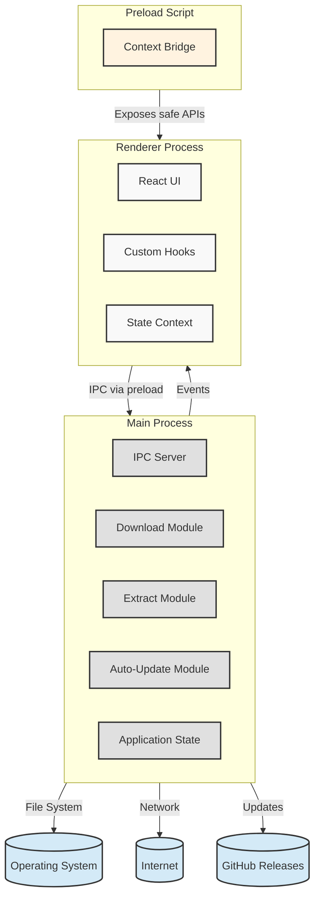
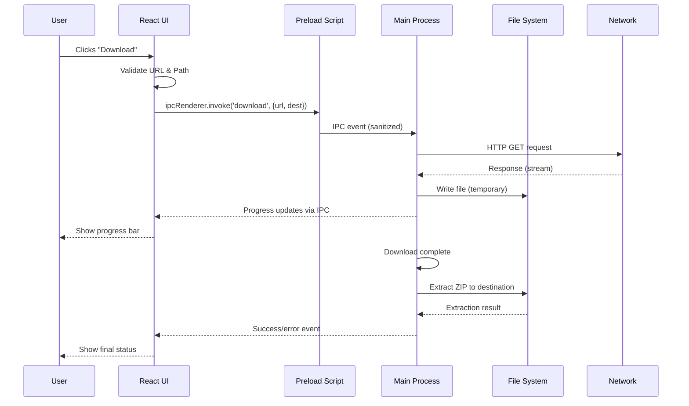
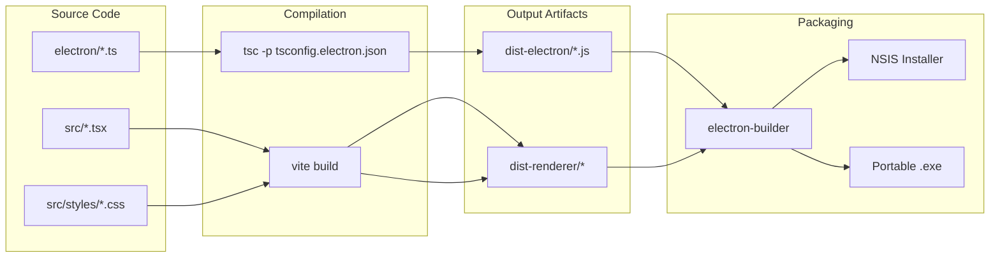

# Window Downloader

<div align="center">

  

  # Window Downloader

  **A Windows desktop application for downloading and extracting project archives (ZIP) with a modern React UI.**

  [](https://github.com/kk666679/Dashboardhr/tree/main/WindowDownloader)
  [](https://electronjs.org/)
  [](https://reactjs.org/)
  [](https://www.typescriptlang.org/)
  [](https://vitejs.dev/)
  [](https://npmjs.com)

</div>

---

## Table of Contents

- [About](#about)
- [Features](#features)
- [Architecture](#architecture)
- [Tech Stack](#tech-stack)
- [Project Structure](#project-structure)
- [Getting Started](#getting-started)
  - [Prerequisites](#prerequisites)
  - [Installation](#installation)
  - [Development](#development)
  - [Build & Package](#build--package)
- [Configuration](#configuration)
- [Development Notes](#development-notes)
- [Testing](#testing)
- [Contributing](#contributing)
- [License](#license)

---

## About

**Window Downloader** is a lightweight desktop application built with **Electron** and **React** that allows users to download ZIP archives from a given URL and extract them to a destination folder. It is designed for Windows (x64) and is part of the **AiFWMS** ecosystem.

The app provides a clean, responsive interface and uses **JSZip** for extraction, **electron-updater** for automatic updates, and **Vite** for fast development and building.

---

## Features

- **Download & Extract** – Enter a URL and a destination path to fetch a ZIP archive and extract its contents.
- **Progress Feedback** – Visual progress indicators during download and extraction.
- **Offline Ready** – Once installed, works without an internet connection (except for updates).
- **Auto‑Update** – Built‑in update support via GitHub Releases (requires `GH_TOKEN` for publishing).
- **Portable & Installer** – Available as both an NSIS installer and a single portable `.exe`.

---

## Architecture

The application follows a classic Electron pattern with clear separation of concerns:



### Data Flow (Download & Extract Sequence)

The diagram below shows the sequence of events when a user initiates a download:



---

## Tech Stack

| Layer | Technology | Purpose |
|-------|------------|---------|
| **Frontend** | React 19, TypeScript, Tailwind CSS (optional, not yet fully integrated) | UI components and logic |
| **Desktop Framework** | Electron 43 | Cross‑platform desktop shell (Windows‑focused) |
| **Build Tool** | Vite 8 | Fast bundling for renderer and dev server |
| **Backend (Node)** | Node.js 22+ (via Electron) | Main process, IPC, file system operations |
| **Archiving** | JSZip 3 | ZIP extraction |
| **Auto‑Update** | electron-updater 6 | Update delivery via GitHub Releases |
| **Packaging** | electron-builder 26 | NSIS installer + portable executable |
| **Testing** | Vitest 4 | Unit testing (Node & React) |

---

## Project Structure

A concise overview of the key directories:

```
WindowDownloader/
├── assets/                     # App icon (icon.ico)
├── dist-electron/              # Compiled Electron main/preload (generated)
├── dist-renderer/              # Compiled React app (generated)
├── electron/                   # Electron source code (main, preload, IPC, updater)
│   ├── main.ts
│   ├── preload.ts
│   ├── ipc.ts
│   ├── updater.ts
│   ├── download.ts
│   ├── extract.ts
│   ├── state-manager.ts
│   └── ipc-contract.ts
├── src/                        # React app (renderer)
│   ├── App.tsx
│   ├── main.tsx
│   └── styles/index.css
├── tests/                      # Unit tests (Vitest)
├── electron-builder.yaml       # Packaging configuration
├── package.json                # Project manifest and scripts
├── tsconfig.json               # TypeScript config for renderer
├── tsconfig.electron.json      # TypeScript config for Electron
├── vite.config.ts              # Vite config for renderer
├── vitest.config.ts            # Vitest config
└── README.md                   # This file
```

### Build & Packaging Flow



---

## Getting Started

### Prerequisites

- **Node.js** v22 or later (recommended) – [Download](https://nodejs.org/)
- **npm** (comes with Node.js)
- **Git** (optional, for cloning)

For packaging on Linux (if you need to build the NSIS installer), you will need **Wine** with 32‑bit support and a graphical environment (for verification steps). See [Development Notes](#development-notes) for workarounds.

### Installation

Clone the repository and install dependencies:

```bash
git clone https://github.com/supportHalal/aifwms.git
cd aifwms/WindowDownloader
npm install
```

### Development

Start the development environment with hot‑reload for both Electron and React:

```bash
npm run electron:dev
```

This will:
- Compile Electron source (`electron/` → `dist-electron/`) in watch mode.
- Launch the Vite dev server for React (`http://127.0.0.1:5173`).
- Wait for the dev server to be ready, then start Electron.

Alternatively, you can run each part separately:
- `npm run dev` – start only the React dev server.
- `npm run build:electron` – compile Electron code once.
- `npm run start` – build all and run the packaged app.

### Build & Package

To create a production build (both renderer and Electron) and package for Windows:

1. **Build the app** (compiles both sides):
   ```bash
   npm run build
   ```

2. **Package for Windows** (NSIS installer + portable .exe):
   ```bash
   npm run dist:win
   ```

The outputs will be placed in the `dist/` directory:
- `window-downloader-1.0.0-win-x64.exe` – NSIS installer
- `Window.exe` – Portable executable (no installation needed)

If you only need the portable version, run:
```bash
npm run dist:win -- --win portable
```

> **Note:** Building on Linux may require additional configuration (see [Development Notes](#development-notes)).

---

## Configuration

The main packaging configuration is in `electron-builder.yaml`. Key settings:

- **`win.target`** – `nsis` and `portable` (Windows only).
- **`win.verify: false`** – disables Wine verification on Linux CI (prevents GUI errors).
- **`publish`** – points to GitHub Releases for auto‑update.
- **`asarUnpack`** – unpacks `electron-updater` from the ASAR archive (required for native bindings).

For auto‑update to work, set the `GH_TOKEN` environment variable before running `npm run dist:win` or `npm run dist`.

---

## Development Notes

### Building on Linux (Codespaces, CI)

- **NSIS installer** requires Wine to run `makensis.exe`. To avoid this, build only the portable `.exe` as shown above.
- The `verify: false` flag in `electron-builder.yaml` prevents Electron Builder from attempting to launch the `.exe` via Wine after packaging.
- If you need the NSIS installer, install `wine32` and `wine` on your Linux system, or use a Windows build runner (e.g., GitHub Actions with `windows-latest`).

### Tailwind CSS

The renderer currently uses Tailwind CSS v4, but the integration is not yet complete. To enable full styling:
1. Install `@tailwindcss/vite`.
2. Add the plugin to `vite.config.ts`.
3. Replace the CSS import in `src/styles/index.css` with `@import "tailwindcss";`.

### TypeScript

Two separate TypeScript configurations are used:
- `tsconfig.json` – for the React renderer (ESNext modules, JSX).
- `tsconfig.electron.json` – for Electron main/preload (NodeNext modules, no JSX).

Make sure to run `npm run build:electron` after any changes to `electron/` code.

---

## Testing

Unit tests are written with **Vitest** and located in the `tests/` directory.

Run all tests:

```bash
npm run test
```

---

## Contributing

This project is part of the AiFWMS suite. For contributions, please:

1. Fork the repository.
2. Create a feature branch.
3. Follow the existing code style (ESLint and Prettier are recommended).
4. Submit a pull request with a clear description of changes.

Please ensure that tests pass and that the app builds successfully before opening a PR.

---

## License

This project is proprietary and owned by **AiFWMS**. All rights reserved.  
See the `LICENSE` file in the root of the repository for full terms.
